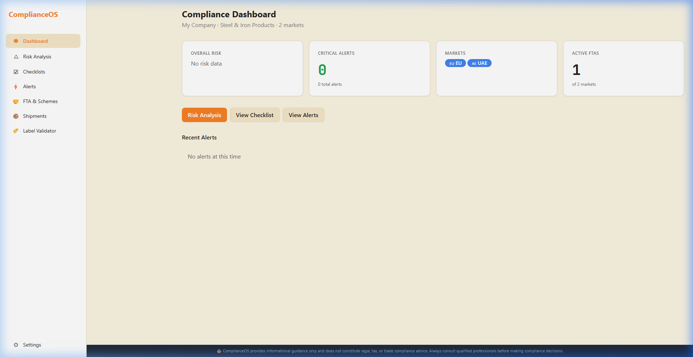
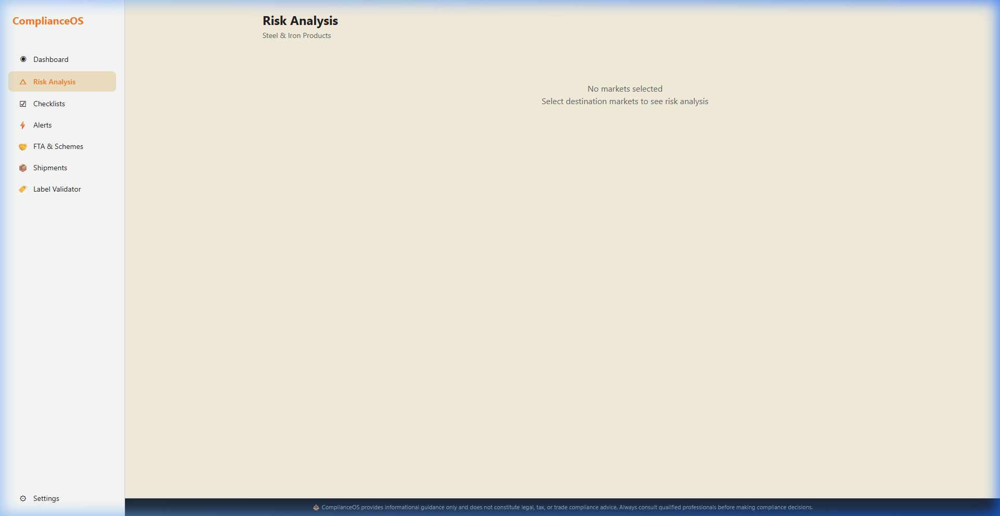
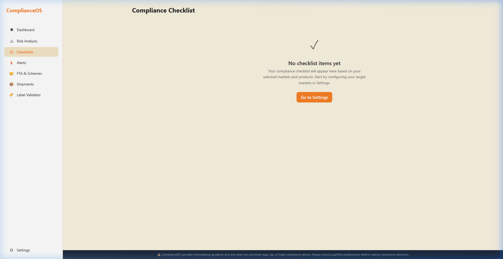
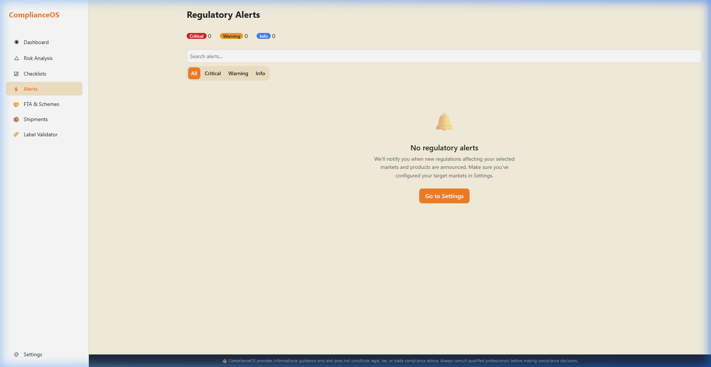
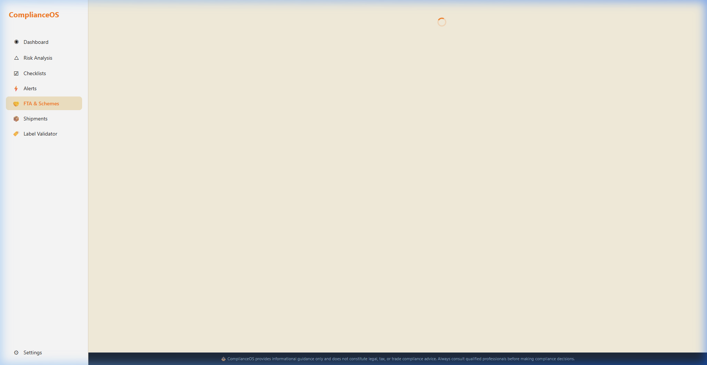
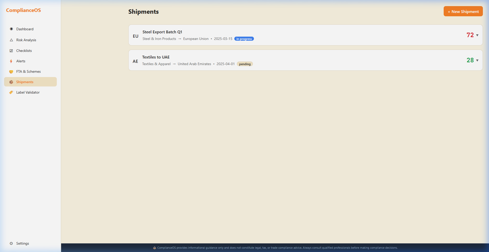
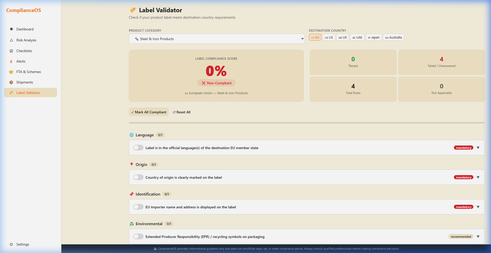

<![CDATA[

# 🌍 ComplianceOS

### Your All-in-One Trade Compliance Co-Pilot

**Stop worrying about regulations. Start growing your exports.**

---

*February 2026 · Version 1.0*

---

## 🤔 Why Does ComplianceOS Exist?

**International trade is complicated. It shouldn't be.**

If you're an Indian exporter or MSME, you already know the pain:

- 📋 **Dozens of regulations** to track across different countries — EU, US, UK, UAE, Japan, Australia — each with their own rules
- ⏰ **Changing deadlines** for things like CBAM carbon reporting, Digital Product Passports, and EUDR deforestation requirements
- 📝 **Mountains of paperwork** — IEC certificates, GST/LUT compliance, phytosanitary certificates, certificates of origin — the list never ends
- 💰 **Missed savings** from Free Trade Agreements and government schemes like RoDTEP and PLI that could save you thousands in duty
- 🚫 **Shipments stuck at customs** because one label was wrong or one document was missing

**ComplianceOS was built to solve all of this — in one place.**

We take the entire mess of international trade compliance and turn it into a simple, step-by-step process. Think of us as your **compliance co-pilot** — always watching, always alerting, always guiding.

---

## 🎯 What Does ComplianceOS Handle?

| What We Do | How It Helps You |
|---|---|
| **🔍 Risk Analysis** | Know your compliance risk score *before* you ship — not after customs holds your goods |
| **✅ Smart Checklists** | Auto-generated, country-specific checklists so you never miss a single document |
| **🔔 Regulatory Alerts** | Real-time notifications about changing rules, deadlines, and new requirements |
| **💸 FTA & Scheme Savings** | Automatically identify trade agreements and government schemes that save you money |
| **📦 Shipment Tracking** | Track every shipment's compliance status from start to finish |
| **🏷️ Label Validation** | Verify your product labels meet destination-country rules *before* printing |
| **⚙️ Easy Configuration** | Set up your products, markets, and integrations in minutes |

---

## 🏆 Why Should You Try ComplianceOS?

> **Because one missed deadline or one wrong label can cost you weeks of delay and lakhs in penalties.**

Here's what our users experience:

✅ **Save hours every week** — No more checking 20 different government websites  
✅ **Prevent shipment delays** — Catch missing documents before they become problems  
✅ **Save money on duties** — Automatically discover FTA benefits and export schemes  
✅ **Stay ahead of regulations** — Get alerts 90 days before deadlines hit  
✅ **Go paperless** — Track everything digitally, no more spreadsheets  
✅ **Sleep better** — Know your compliance is handled by a system that never forgets  

---

# 📖 Step-by-Step Guide

### Let's walk through everything together!

*Don't worry if you've never used a compliance tool before. We'll explain every step like you're seeing it for the first time.*

---

## Step 1: Create Your Account 🆕

The very first thing you need to do is create a free account. It takes less than 30 seconds.

**Here's what the sign-up screen looks like:**

**What to do:**
1. Open ComplianceOS in your web browser
2. Click on **"Sign Up"**
3. Enter your **Full Name** (e.g., "Rajesh Kumar")
4. Enter your **Email Address** (e.g., "rajesh@mycompany.com")
5. Enter a **Password** (at least 6 characters — make it strong!)
6. Click the orange **"Create Account"** button
7. Check your email for a **confirmation link** and click it

> [!TIP]
> **Already have an account?** Simply click "Sign In" instead and enter your email and password.

**Here's what the sign-in screen looks like:**

That's it! You're in. 🎉

---

## Step 2: Your Compliance Dashboard — The Big Picture 📊

After signing in, you'll land on your **Dashboard**. Think of this as your **command center** — everything important about your trade compliance is visible right here.

**Here's what each part of the dashboard shows you:**

| Section | What It Means | Why It Matters |
|---|---|---|
| **🎯 Risk Score Gauge** | A single number (0-100) that shows your overall compliance health | Green = You're safe. Orange = Pay attention. Red = Act now! |
| **🚨 Critical Alerts** | How many urgent regulatory changes need your attention right now | Click here to see what deadlines are approaching |
| **🌐 Tracked Markets** | The countries you export to (EU, UAE, Japan, etc.) with their status | See at a glance which markets need work |
| **📋 Active FTAs** | Free Trade Agreements that apply to your products | These agreements can save you significant import duty! |
| **📰 Live Alert Feed** | A scrolling list of the latest regulatory updates | Stay informed without checking government websites |

> [!IMPORTANT]
> **Your Risk Score is the most important number.** If it's above 60, you should review your alerts and checklists immediately. Below 30 means you're in great shape!

**Navigation:** Look at the **sidebar on the left**. This is how you move between different sections of ComplianceOS. We'll explore each one now.

---

## Step 3: Risk Analysis — Know Your Risk Before You Ship 🔍

Click on **"Risk Analysis"** in the left sidebar.

This is where ComplianceOS shows you exactly **what risks** exist for your specific products and markets — and what to do about them.

**How to use it:**

1. **Select your Target Market** from the dropdown (e.g., "European Union")
2. The **Risk Gauge** will update to show your risk score for that specific market
3. Below the gauge, you'll see **Risk Factors** — specific things that affect your risk:

   | Risk Factor | Severity | What It Means |
   |---|---|---|
   | **CBAM Carbon Reporting** | 🔴 High | EU requires carbon emission data for steel, aluminum, cement, etc. |
   | **ESG Scope 3 Disclosure** | 🟡 Medium | Some markets require supply chain sustainability reporting |
   | **Active FTA Benefits** | 🟢 Positive | You have a trade agreement that *reduces* import duties! |

4. Click on any risk factor to see **specific recommendations** — exactly what steps you need to take

> [!TIP]
> **Try switching between different markets** using the dropdown. You'll see how risk levels change depending on the destination country. Exporting to the EU with CBAM products? Higher risk. Exporting to UAE with an active FTA? Lower risk!

---

## Step 4: Compliance Checklists — Never Miss a Document ✅

Click on **"Checklists"** in the sidebar.

This is your **to-do list for every shipment**. ComplianceOS automatically generates a checklist based on your product and destination country.

**How to use it:**

1. **Choose your market** using the tabs at the top (EU, UAE, Japan, etc.)
2. You'll see a **progress bar** showing how much of the checklist you've completed
3. The checklist is organized into **categories**:

   **📋 Pre-Shipment Documentation**
   - ☐ Commercial Invoice
   - ☐ Packing List
   - ☐ Bill of Lading / Airway Bill

   **📜 Certifications**
   - ☐ FSSAI Export Certificate (for food products)
   - ☐ Phytosanitary Certificate
   - ☐ HACCP Certification

   **🇮🇳 Indian Compliance**
   - ☐ IEC (Importer Exporter Code)
   - ☐ AD Code Registration
   - ☐ GST/LUT Filing
   - ☐ FEMA Compliance

4. **Click on any item** to mark it as complete ✓
5. Watch the **progress bar fill up** as you check off items!

> [!NOTE]
> **The checklist adapts automatically!** If you're exporting food to the EU, it will include FSSAI and phytosanitary certificates. If you're exporting chemicals to Japan, it will include different safety certifications. You don't need to remember — ComplianceOS remembers for you.

---

## Step 5: Regulatory Alerts — Stay Ahead of Changes 🔔

Click on **"Alerts"** in the sidebar.

This is your **early warning system**. Governments change trade rules all the time. ComplianceOS monitors these changes and alerts you before they affect your shipments.

**How to use it:**

1. At the top, you'll see **filter buttons**:
   - **All** — Shows every alert
   - **🔴 Critical** — Urgent items with imminent deadlines
   - **🟡 Warning** — Important changes to prepare for
   - **🔵 Info** — General updates and industry news

2. Each alert card shows:
   - **What's happening** (e.g., "EU Digital Product Passport Mandate")
   - **How urgent it is** (Critical / Warning / Info)
   - **When the deadline is** (e.g., "47 days remaining")
   - **What action to take** (clear, specific steps)

3. Click on any alert to see **detailed information** and regulation citations

**Example alerts you might see:**

| Alert | Severity | What To Do |
|---|---|---|
| EU Digital Product Passport | 🔴 Critical | Register products in EU database before deadline |
| CBAM Carbon Reporting Q1 | 🟡 Warning | Submit quarterly emission data by filing date |
| EUDR Deforestation Rules | 🔴 Critical | Prepare supply chain documentation for timber/palm oil |
| India-UK FTA Negotiations | 🔵 Info | Potential new trade agreement — monitor for updates |

> [!CAUTION]
> **Never ignore Critical alerts!** These have tight deadlines and failing to comply can result in your shipments being held at the border, heavy fines, or even export bans.

---

## Step 6: FTA & Schemes — Save Money on Duties 💰

Click on **"FTA & Schemes"** in the sidebar.

This is where ComplianceOS helps you **save money**. Many Indian exporters don't realize they're overpaying import duties because they're not using available Free Trade Agreements (FTAs) or government export incentive schemes.

**How to use it:**

1. **Free Trade Agreement (FTA) Cards** — Each card shows:
   - **Agreement Name** (e.g., "India-UAE CEPA")
   - **Status** — Active ✅, Under Negotiation 🟡, or Not Available ❌
   - **Duty Savings** — How much you can save by using this FTA
   - **Preferential vs Standard Rates** — Compare the tariff rates side by side

2. **Indian Export Schemes** — Government schemes that benefit exporters:
   - **RoDTEP** — Remission of duties and taxes on export products
   - **PLI** — Production-Linked Incentive schemes
   - **Advance Authorization** — Duty-free import of inputs for export production

3. **Savings Calculator** — See potential duty savings for your specific products

**Example:**

| Route | Standard Duty | FTA Preferential Rate | Your Savings |
|---|---|---|---|
| Steel → UAE (CEPA) | 5.0% | 0.0% | **₹50,000 per ₹10L shipment** |
| Textiles → Australia (ECTA) | 5.0% | 0.0% | **₹50,000 per ₹10L shipment** |
| Chemicals → Japan (CEPA) | 3.3% | 0.0% | **₹33,000 per ₹10L shipment** |

> [!TIP]
> **Many exporters miss out on lakhs of rupees** in duty savings simply because they don't file for preferential tariff rates under active FTAs. ComplianceOS identifies these savings automatically!

---

## Step 7: Shipment Tracking — Monitor Every Shipment 📦

Click on **"Shipments"** in the sidebar.

This is where you **create and track individual shipments** with per-shipment compliance scores.

**How to use it:**

1. Click the **"New Shipment"** button (orange, top-right)
2. Fill in the details:
   - **Shipment Name** (e.g., "Q1 Steel Batch" or "March Food Consignment")
   - **Product Category** (e.g., Steel, Food, Textiles)
   - **Destination Country** (e.g., EU, UAE)
   - **Shipment Date**
3. Click **"Create Shipment"** — Done!

**What happens next:**
- ComplianceOS automatically generates a **checklist** for that shipment
- You get a **compliance score** showing how ready the shipment is
- The score updates as you check off documentation items

| Shipment | Destination | Compliance Score | Status |
|---|---|---|---|
| Q1 Steel Batch | EU 🇪🇺 | 85% 🟢 | Almost ready! |
| Textile Consignment | UAE 🇦🇪 | 72% 🟡 | Missing some certificates |
| March Food Export | Japan 🇯🇵 | 45% 🔴 | Needs attention |

> [!IMPORTANT]
> **A compliance score below 50% means the shipment is NOT ready to go.** Complete the remaining checklist items before shipping to avoid delays at customs.

---

## Step 8: Label Validator — Get Labels Right the First Time 🏷️

Click on **"Label Validator"** in the sidebar.

**Did you know?** Incorrect labeling is one of the **top reasons** shipments get held at customs. Different countries have different labeling requirements — wrong language, missing certifications, incorrect format — any of these can stop your goods at the border.

**How to use it:**

1. **Select your Product Category** (e.g., "Food & Agriculture")
2. **Select your Destination Country** (e.g., "European Union")
3. ComplianceOS loads the **exact labeling rules** for that combination
4. **Toggle each requirement** to check if your label meets it:

   | Requirement | Status | What It Means |
   |---|---|---|
   | Ingredient Listing | ✅ Compliant | Your label lists all ingredients |
   | Allergen Declaration | ✅ Compliant | Allergens are properly highlighted |
   | Nutritional Information | ❌ Not Compliant | Missing nutritional panel — add it! |
   | Country of Origin Marking | ✅ Compliant | "Made in India" is on the label |

5. Watch the **compliance score** update in real-time as you toggle items
6. Click on any requirement to see the **exact regulation** it comes from

**Try switching countries!** Change from "EU" to "UAE" and watch the requirements change — suddenly you'll see rules about Arabic-language labeling and Halal certification.

**Bulk Actions:**
- **"Mark All Compliant"** — When all labels are verified
- **"Reset All"** — Start fresh for a new product

> [!TIP]
> **Always run the Label Validator BEFORE printing your labels.** Reprinting and relabeling after shipping costs time and money!

---

## Step 9: Settings — Set Up Your Company Profile ⚙️

Click on **"Settings"** in the sidebar.

This is where you configure ComplianceOS to match **your specific business**. The more accurate your settings, the better ComplianceOS can help you.

**What to configure:**

| Setting | What to Enter | Why It Matters |
|---|---|---|
| **Company Profile** | Your company name, size (micro/small/medium/large), and contact details | Risk scores adjust based on company size — MSMEs get additional compliance guidance |
| **Product Categories** | Select what you export: Steel, Textiles, Food, Chemicals, Pharmaceuticals, etc. | Determines which regulations apply to YOU |
| **Target Markets** | Check which countries you export to: EU, US, UK, UAE, Japan, Australia | Generates country-specific checklists and alerts |
| **API Keys** | Connect with external trade data sources | Advanced feature for integration with customs systems |

**Quick setup (takes 60 seconds):**
1. Enter your company name
2. Select your company size
3. Pick your product categories (you can select multiple)
4. Check your export destination countries
5. Click **Save** 💾

> [!NOTE]
> **You can change these settings anytime.** As your business grows and you enter new markets, just come back here and update your profile. ComplianceOS will immediately recalculate everything.

---

## 🗺️ Quick Navigation Guide

Here's a cheat sheet for getting around ComplianceOS:

| 🔢 | Section | What To Use It For | Quick Tip |
|----|---------|-------------------|-----------|
| 1 | **Dashboard** | See the big picture at a glance | Check this daily for new alerts |
| 2 | **Risk Analysis** | Understand risks before shipping | Switch markets to compare risk levels |
| 3 | **Checklists** | Track documentation per market | Use tabs to switch between countries |
| 4 | **Alerts** | Stay ahead of regulatory changes | Filter by "Critical" for urgent items |
| 5 | **FTA & Schemes** | Discover duty savings | Check FTA benefits for every route |
| 6 | **Shipments** | Track individual shipments | Create one for every major batch |
| 7 | **Label Validator** | Verify labels before printing | Try different country requirements |
| 8 | **Settings** | Configure your business profile | Update when entering new markets |

---

## ❓ Frequently Asked Questions

**Q: Do I need to be a compliance expert to use ComplianceOS?**  
A: Not at all! ComplianceOS is designed for exporters of all sizes. The platform explains every regulation in plain language and tells you exactly what to do.

**Q: Which countries does ComplianceOS support?**  
A: We currently cover **EU, US, UK, UAE, Japan, and Australia** — the major export destinations for Indian businesses. We're constantly expanding.

**Q: How does ComplianceOS know what regulations apply to me?**  
A: Based on your product categories and target markets in Settings, ComplianceOS automatically maps the applicable regulations, generates relevant checklists, and surfaces the right alerts.

**Q: Can multiple team members use ComplianceOS?**  
A: Yes! Each team member can create their own account and work on compliance together.

**Q: What if a regulation changes?**  
A: ComplianceOS monitors regulatory changes in real-time. You'll receive an alert the moment something changes that affects your exports.

---

---

## 🤝 We're Here to Help

> *"Trade should be about growing your business — not fighting paperwork.*
>
> *At ComplianceOS, we've built everything you need to navigate the complex world of international trade compliance. From risk analysis to label validation, from regulatory alerts to duty savings — we've got you covered.*
>
> *And if you ever feel stuck, remember: **we're here to help with everything we can to make trade easy.** Because when trade becomes simpler, businesses thrive, economies grow, and the world gets a little more connected."*
>
> — **The ComplianceOS Team** 🌏

---

### Ready to Get Started?

📧 **Contact us** for a personalized demo tailored to your products and markets.

🌐 **Visit** [app.avalara-india.com](https://app.avalara-india.com) to create your free account today.

📞 **Need help?** Our team is just one message away.

---

*ComplianceOS — Trade compliance, simplified. Always.* ✨

]]>
